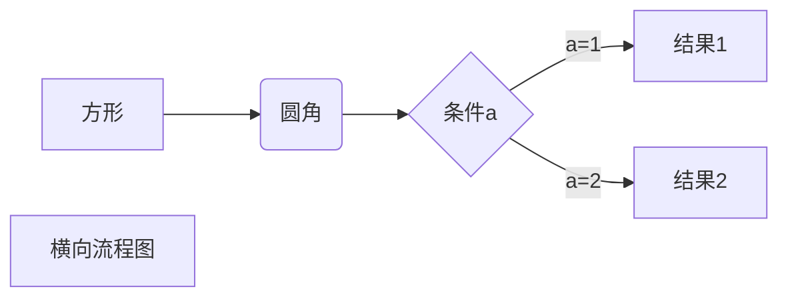
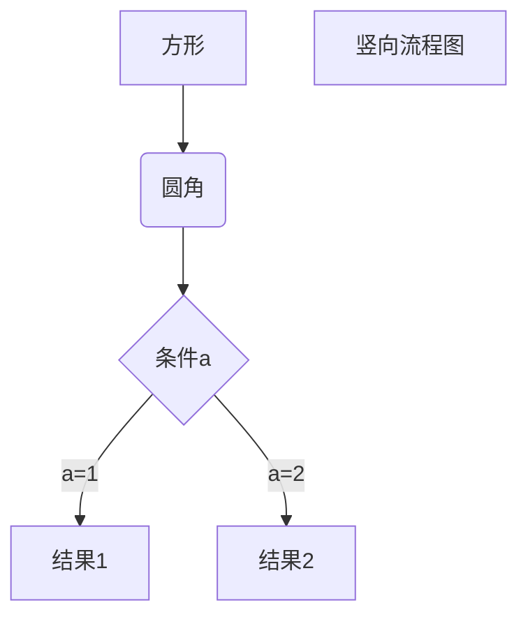
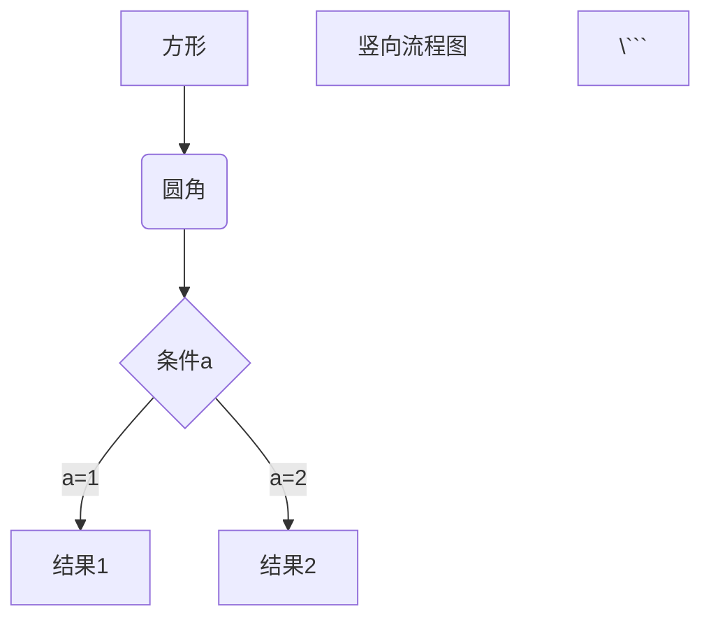
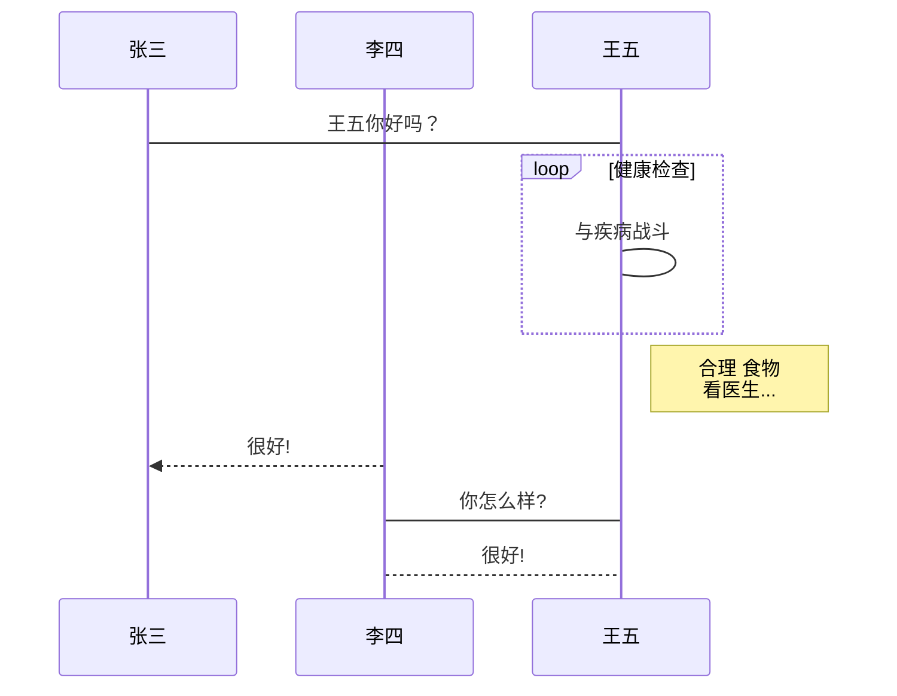
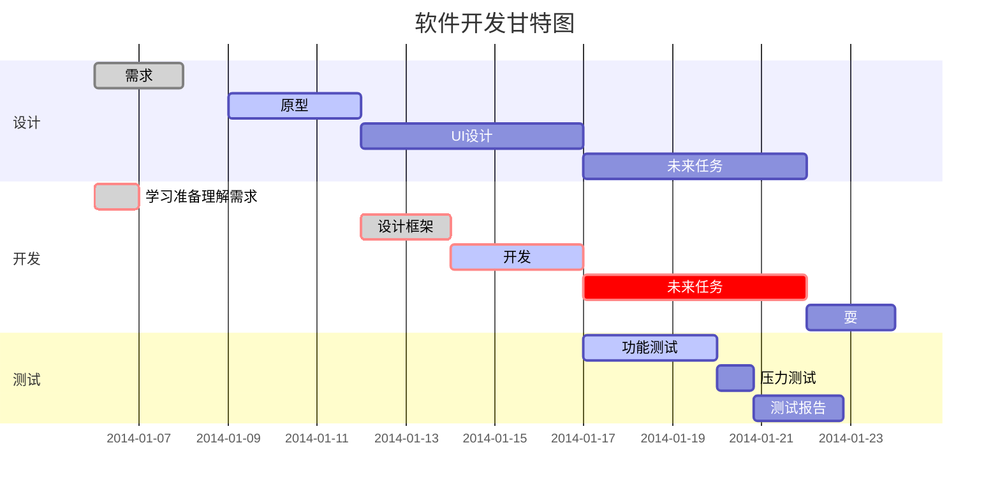

+ [https://markdown.p2hp.com/basic-syntax/#headings](https://markdown.p2hp.com/basic-syntax/#headings) 


# 一级标题
## 二级标题
### 三级标题
#### 四级标题
##### 五级标题
###### 六级标题

```javascript
# 一级标题
## 二级标题
### 三级标题
#### 四级标题
##### 五级标题
###### 六级标题
```

## `区块`
> 用代码改变世界 
>

```javascript
> 用代码改变世界 
```

## `代码块`
```javascript
var a = 1;
var b = 2;
```

```js  
var a = 1;  
var b = 2;

```

## `片段代码`
`console.log('hello world')` 

```javascript
`console.log('hello world')` 
```


## `列表`
+ 第一项
+ 第二项
+ 第三项
+ 第一项
+ 第二项
+ 第三项
+ 第一项
+ 第二项
+ 第三项


```javascript
* 第一项
* 第二项
* 第三项

+ 第一项
+ 第二项
+ 第三项 

- 第一项
- 第二项
- 第三项
```

## `字体`
_斜体文本_  
_斜体文本_  
**粗体文本**  
**粗体文本**  
_**粗斜体文本**_  
_**粗斜体文本**_


```javascript
*斜体文本*
_斜体文本_
**粗体文本**
__粗体文本__
***粗斜体文本***
___粗斜体文本___
```

## `链接`

这是一个链接 [GitHub](https://github.com)


```javascript
这是一个链接 [GitHub](https://github.com)
```

## `在线图片`

<!-- 这是一张图片，ocr 内容为： -->


<!-- 这是一张图片，ocr 内容为： -->


```javascript


 
 
```


## `表格`

| 左对齐 | 右对齐 | 居中对齐 |
| :--- | ---: | :---: |
| 单元格 | 单元格 | 单元格 |
| 单元格 | 单元格 | 单元格 |


```javascript
| 左对齐 | 右对齐 | 居中对齐 |
| :-----| ----: | :----: |
| 单元格 | 单元格 | 单元格 |
| 单元格 | 单元格 | 单元格 |


| 居中对齐 | 居中对齐 | 居中对齐 |
| :----: | :----: | :----: |
| 单元格 | 单元格 | 单元格 |
| 单元格 | 单元格 | 单元格 |

```

## md支持部分html标签
`<kbd> <b> <i> <em> <sup> <sub> <br>`  

我是kbd标签  

**我是b标签**  

_我是b标签_  

_我是b标签_  

<sup>我是sup标签</sup><sub>我是sub标签</sub>

  
我是br标签

```javascript
<kbd>我是kbd标签</kbd>  
<kbd>Command</kbd> + <kbd>s</kbd> 保存
```

## md换行
1  
2

```javascript
  1 (两个空格加回车)
  2
```

## md的转义
> 用反斜线 \ 转义
>

```javascript
支持符号前 加 转义符的有: 
\   反斜线
`   反引号
*   星号
_   下划线
{}  花括号
[]  方括号
()  小括号
#   井字号
+   加号
-   减号
.   英文句点
!   感叹号

```

## 流程图
> 横向流程图
>



```javascript
\```mermaid
graph LR
A[方形] -->B(圆角)
    B --> C{条件a}
    C -->|a=1| D[结果1]
    C -->|a=2| E[结果2]
    F[横向流程图]
\```
```

> 竖向流程图
>



```javascript


> 标准流程图源码格式：
>

```flowchart
st=>start: 开始框
op=>operation: 处理框
cond=>condition: 判断框(是或否?)
sub1=>subroutine: 子流程
io=>inputoutput: 输入输出框
e=>end: 结束框
st->op->cond
cond(yes)->io->e
cond(no)->sub1(right)->op
```

```javascript
\```flow 
st=>start: 开始框
op=>operation: 处理框
cond=>condition: 判断框(是或否?)
sub1=>subroutine: 子流程
io=>inputoutput: 输入输出框
e=>end: 结束框
st->op->cond
cond(yes)->io->e
cond(no)->sub1(right)->op
\```
```

> 标准流程图源码格式（横向）：
>

```flowchart
st=>start: 开始框
op=>operation: 处理框
cond=>condition: 判断框(是或否?)
sub1=>subroutine: 子流程
io=>inputoutput: 输入输出框
e=>end: 结束框
st(right)->op(right)->cond
cond(yes)->io(bottom)->e
cond(no)->sub1(right)->op
```

```javascript
\```flow
st=>start: 开始框
op=>operation: 处理框
cond=>condition: 判断框(是或否?)
sub1=>subroutine: 子流程
io=>inputoutput: 输入输出框
e=>end: 结束框
st(right)->op(right)->cond
cond(yes)->io(bottom)->e
cond(no)->sub1(right)->op
\```
```

> UML时序图源码样例：
>

```plain
对象A->对象B: 对象B你好吗?（请求）
Note right of 对象B: 对象B的描述
Note left of 对象A: 对象A的描述(提示)
对象B-->对象A: 我很好(响应)
对象A->对象B: 你真的好吗？
```

```javascript
\```sequence
对象A->对象B: 对象B你好吗?（请求）
Note right of 对象B: 对象B的描述
Note left of 对象A: 对象A的描述(提示)
对象B-->对象A: 我很好(响应)
对象A->对象B: 你真的好吗？
\```
```

> UML时序图源码复杂样例：
>

```plain
Title: 标题：复杂使用
对象A->对象B: 对象B你好吗?（请求）
Note right of 对象B: 对象B的描述
Note left of 对象A: 对象A的描述(提示)
对象B-->对象A: 我很好(响应)
对象B->小三: 你好吗
小三-->>对象A: 对象B找我了
对象A->对象B: 你真的好吗？
Note over 小三,对象B: 我们是朋友
participant C
Note right of C: 没人陪我玩
```

```javascript
\```sequence
Title: 标题：复杂使用
对象A->对象B: 对象B你好吗?（请求）
Note right of 对象B: 对象B的描述
Note left of 对象A: 对象A的描述(提示)
对象B-->对象A: 我很好(响应)
对象B->小三: 你好吗
小三-->>对象A: 对象B找我了
对象A->对象B: 你真的好吗？
Note over 小三,对象B: 我们是朋友
participant C
Note right of C: 没人陪我玩
\```
```

> UML标准时序图样例：
>



```javascript
\```mermaid
%% 时序图例子,-> 直线，-->虚线，->>实线箭头
  sequenceDiagram
    participant 张三
    participant 李四
    张三->王五: 王五你好吗？
    loop 健康检查
        王五->王五: 与疾病战斗
    end
    Note right of 王五: 合理 食物 <br/>看医生...
    李四-->>张三: 很好!
    王五->李四: 你怎么样?
    李四-->王五: 很好!
\```
```

> 甘特图样例
>



```javascript
\```mermaid
%% 语法示例
        gantt
        dateFormat  YYYY-MM-DD
        title 软件开发甘特图
        section 设计
        需求                      :done,    des1, 2014-01-06,2014-01-08
        原型                      :active,  des2, 2014-01-09, 3d
        UI设计                     :         des3, after des2, 5d
    未来任务                     :         des4, after des3, 5d
        section 开发
        学习准备理解需求                      :crit, done, 2014-01-06,24h
        设计框架                             :crit, done, after des2, 2d
        开发                                 :crit, active, 3d
        未来任务                              :crit, 5d
        耍                                   :2d
        section 测试
        功能测试                              :active, a1, after des3, 3d
        压力测试                               :after a1  , 20h
        测试报告                               : 48h
\```
```


## 数学表达式
`$ ... $`  

$ e^{i\pi} + 1 = 0 $

```javascript
$e^{i\pi} + 1 = 0$
```

`$$ ... $$`  

$ e^{i\pi} + 1 = 0 $

```javascript
$$e^{i\pi} + 1 = 0$$
```

`$$ ... $$`  

$ \sum_{n=1}^{100} n $

```javascript
$$\sum_{n=1}^{100} n$$
```

$ \begin{Bmatrix}
    a & b \\
    c & d
\end{Bmatrix} $

```javascript
语法为: 
$$
\begin{Bmatrix}
    a & b \\
    c & d
\end{Bmatrix}
$$
```

$ \begin{CD}
    A @>a>> B \\
@VbVV @VVcV \\
    C @= D
\end{CD} $

```javascript
语法为: 
$$
\begin{CD}
    A @>a>> B \\
@VbVV @VVcV \\
    C @= D
\end{CD}
$$
```

