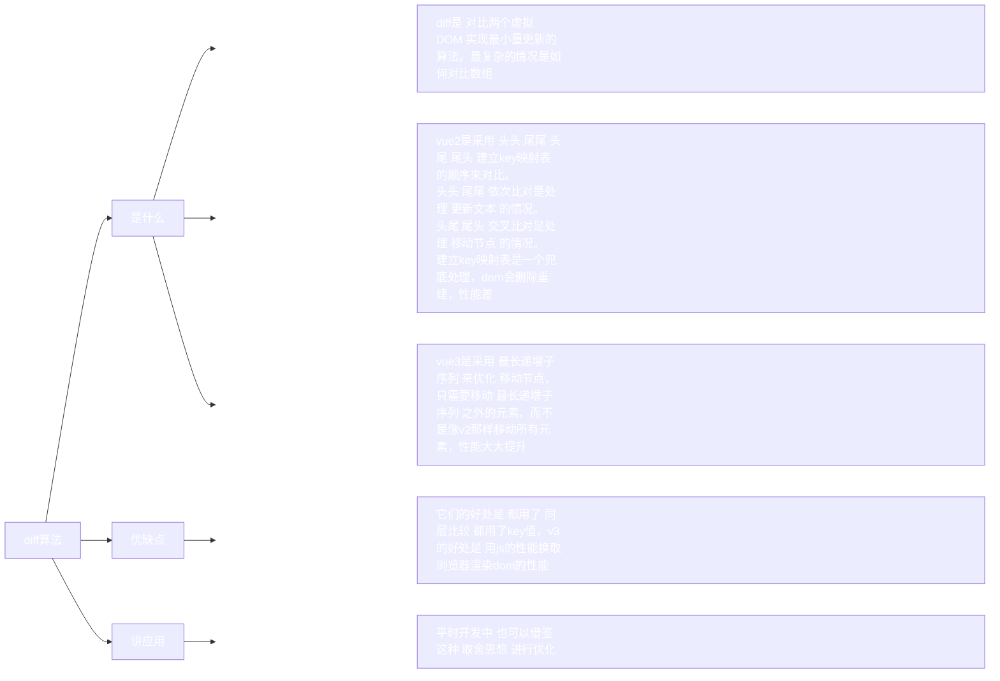

# diff算法

## 正文

● 扩展问题
● 为什么要按照 头头 尾尾 头尾 尾头 的顺序比对？
  ○ 照时间复杂度递增来排序的 ， 为了优先处理 最常见的更新场景
● 建立旧数组key映射表 具体是怎样的?
  ○ { key: 下标， ... } 
  ○ 一个 map 对象，key 是旧数组的 key 值，value 是对应的下标
  ○ 新数组的 key 在映射表里面找 找不到就创建 找到就移动。
  ○ 这个循环查找 性能就不好 v3 用最长递增子系列 进行优化了 
● 最长递增子系列是怎么做的？
● 扩展问题
● vue 团队也是 学习其他人的 diff 算法 运用到 vue 框架中的 我们学习后也可以运用到平时开发中。 
● 如何判断 dom 没有更新？
  ○ 打开 F12 把 dom 的文本进行修改 ，然后在点击更新
  ○ 修改后没有变说明 dom 是复用的 没有更新。
● 如何判断是同一个虚拟节点
  ○ 标签名 相同 且 key值相同
● 如何移动真实dom？ 插入一个已经存在的节点 就会移动
● 数组越界访问是 undefined 
● 生成数组细节
  ○ 数组长度
    ■ 是新数组剩余项的个数
  ○ 数组项
    ■ 初始值是0 表示创建DOM
    ■ 会根据旧数组项的key 在新数组里面对应的索引+1
    ■ 新数组里面找不到 旧数组项就应该删除
●  v3 时间复杂度 增加了   n * log n
  ○ v3的最长递增子序列的时间复杂度是 O (n * log n)  
  ○ 单从js来看 复杂度比v2 时间复杂度是O(n) 还高  js性能降低了
  ○ 但v3的最长递增子序列是 用js性能 换取 浏览器渲染DOM的性能
  ○ 所以整体来说 v3的性能高于v2
/Users/elpis/core/packages/runtime-core/src/renderer.ts 
function diff(oldArr, newArr) {
    // 两个数组长度不一样 所以需要4个指针 
    let newStartIndex = 0, oldStartIndex = 0;
    let newEndIndex = newArr.length - 1, oldEndIndex = oldArr.length - 1;
    
    while() {
    
       /* 头头 - 开始 */
       if(sameNode(oldArr[oldStartIndex], newArr[newStartIndex])) { // 如果是同一个节点
           patch(); // 更新
           ++startIndex;
       }
       /* 头头 - 结束 */
      
       /* 尾尾 - 开始 */
       else if () {
         
       }
       /* 尾尾 - 结束 */
    }
}

旧数组项的剩余项(中间部份) 
const keyMap = {
  旧数组的key: 旧数组的index
}

新数组的剩余项组成的数组 求这个序列的最长递增子序列 
const arr = new Array(6).fill(0); // [0,0,0,0,0,0]

最长递增子序列就可以确定 哪些元素不用移动

            ● 成数组细节
              ○ 数组长度
                ■ 是新数组剩余项的个数
              ○ 数组项
                ■ 初始值是0 表示创建DOM
                ■ 会根据旧数组项的key 在新数组里面对应的索引+1
                ■ 新数组里面找不到 旧数组项就应该删除

/*
  第一优先级：头头比对、尾尾比对（最快、最理想的情况）

头头（旧前 vs 新前） 和 尾尾（旧后 vs 新后）：

为什么优先？ 因为这两种情况是性能最佳的场景。如果节点相同，意味着它们的位置极有可能根本没有发生变化。

操作成本：只需要进行简单的patchVnode（更新内容）即可，完全不需要进行任何DOM移动操作。只需要移动指针，计算成本极低。

常见场景：在列表的开头或末尾新增/删除一个项时，另一端的项就满足这种比对。

第二优先级：头尾比对、尾头比对（处理移动的常见情况）

头尾（旧前 vs 新后） 和 尾头（旧后 vs 新前）：

为什么其次？ 这两种情况预示着节点发生了跨度的移动。虽然需要移动DOM，但算法依然能通过一次比对就精准定位。

操作成本：需要一次patchVnode和一次insertBefore移动操作。成本比第一种高，但比最后一种低。

常见场景：将一个节点从列表头部移到尾部，或从尾部移到头部。例如 [A, B, C] -> [C, A, B]，第一轮头头（A vs C）不匹配，但尾头（C vs C）匹配，就能发现C从尾部移动到了头部。

最后优先级：暴力查找（最坏情况）

如果以上四种情况全部失败：

这才不得不使用最耗时的方案：拿新前节点的key去旧节点数组中遍历查找。

为什么最后？ 因为它的时间复杂度是O(n)，是成本最高的操作。可能会触发多次查找和移动。

常见场景：列表发生了完全无序的重排，或者中间插入了新项。

// patch 打补丁
function patch(oldVnode, newVnode) {
   if(oldVnode.sel === newVnode.sel && oldVnode.key === newVnode.key) {
     // 进行diff 

     // oldVnode ===  newVnode 什么都不做
    
     // oldVnode.children && newVnode.children // 最复杂情况 

   } else {
     // 不进行diff对比 直接 删除旧的 创建新的
   }
}
*/

