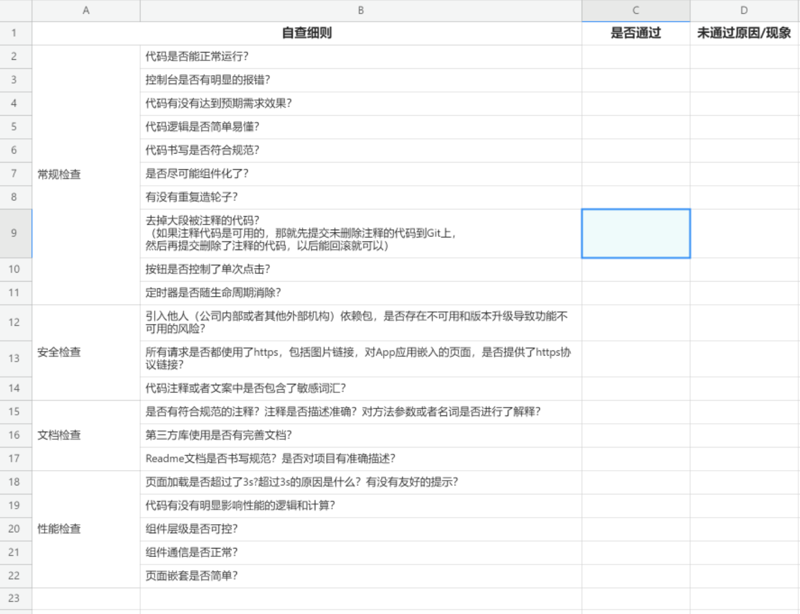
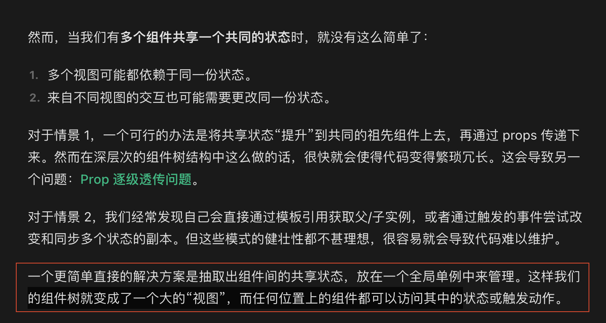
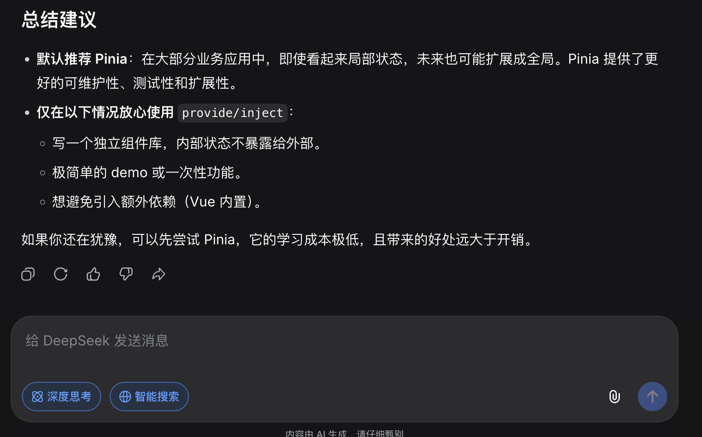
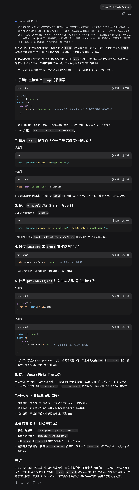
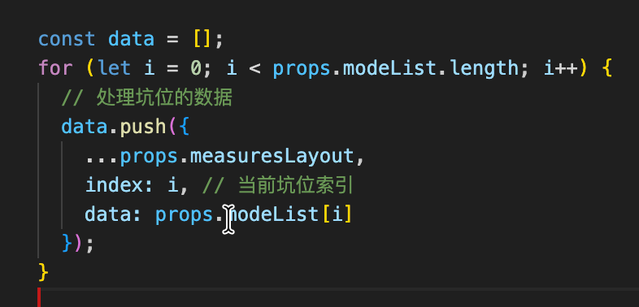

# 前端开发文档

<!-- <iframe width="1000" height="400" 
  src="https://www.yuque.com/dashboard/collections" 
  title="视频标题"
  frameborder="0" 
  allowfullscreen>
</iframe> -->
 

# 问题 - 解决方案 - 结果


## 问题  
1. 新项目 不如 旧项目
2. 团队没有统一规范，大部分功能都是处于能跑就行。
3. 某个模块的负责人请假，业务就只能阻塞。其他人无从下手。


## 解决方案
1. 业务复盘会：在业务不忙的情况下，每一周 或 每两周
2. code review: 大家一起审查 前一周或前两周的 提交代码，形成团队规范文档 1234。
3. 具体指标数据是什么 比如 LSP 多少 

总结： 
1. 定期开会，开会2件事：
    1. 业务复盘，大家都要了解其他模块是怎么做的 大家要了解整体业务。
    2. 代码审查：看其他模块负责人如何写代码 好的就学习 不好的就修改，形成统一规范。
2. 已经用了 provide/inject 
可做轻重构，不要重重构

比如：
1. 必须遵循单向数据流，打破单向数据流就是屎山。（最重要）
2. 不要用provide/inject做通信, provide/inject应用场景是封装隔代的父子组件
3. https://cn.vuejs.org/guide/scaling-up/state-management.html#pinia






image.png

image.png
image.png

## 共同目标
1. 业务 （让老板高兴）
2. 能力成长（让自己高兴） 


新代码按规范写，旧代码有空做轻重构。（时间）

代码审查是必须的 至少核心功能要做代码审查，代码审查之后形成统一文档。后续会引入工具链 eslint prettier强制约束。


1. 开发规范：核心是 store 
2. 如何封装：核心是封装边界问题

router
controller
servers

Store （核心业务数据渲染数据）
views/pages（页面交互逻辑）
Hooks （把页面业务逻辑抽离单独的公共模块）


我的封装思想都是 来自 知名公共库 日积月累
 antd  element  hooks 

比如我封装一个弹窗  没有思路 看 antd的 

放弃class写法 拥抱hooks函数式写法 

框架理念是放弃class写法 原生js常用class写法

拆分模块 必须满足 高内聚 低耦合 （内聚程度 多高算高 耦合程度 多低算低？尽量就行） 

放弃OptionStore 拥抱SetupStore


store 维护的是什么
views 维护的是什么
api 维护的是什么
component 维护的是什么


没有银弹 
业务大于一切

很多问题是 由于当事人不熟悉某个知识点 导致他用自己熟悉的方式（可能不合理）的方式去实现 

Store维护的是 前端的 View Object 简称 VO 视图对象数据

团队成长


遇到问题一般解决步骤：
1. 调研业界方案 结合自己方案 优缺点对比 确定最终方案
2. 

项目已经存在的问题：codereview  埋点耦合业务
项目未来面对的问题：如何共享


code review：目前问题 
1. 组件通信（用store 统一管理状态，不要用 provide/inject数据乱飞）
1. 存在魔法数字（拒绝魔法数字）
2. 变量声明（无脑const 修改用let 不用var）yiyang是无脑let
3. 探针耦合业务。


没有代码审查 就没有代码规范 没有代码规范就是屎山

目录结构
views/ XXX / components / 

提出monorepo  抽离依赖包：这就是业界最优方案


共同目标；
1. hold住业务
2. 提升自己能力

以上 只对事 不对人，有问题一定要提,大家一起把项目搞好。一起成长，以后找工作也有竞争力，这是共赢的结局。  
还有什么问题？


封装：（封装是一个很大）
高内聚 低耦合 


views/pages 页面上  

数据 和 操作数据的方法
const a = ref({});  // 高内聚 低耦合 
function setA() {
  a.value = {}
}


store 没有全局store 的  概念 


store写法 

vuex写法 原始人写法
组合式写法 现代人写法


vuex有根sotre 
pinia已经删除了根store的概念 都是平级的


api store views components 

架构：没有什么是加一层解决不了的，如果有那就再加一层。

最后总结：
定期 codereview 完善规范文档 

有什么问题 。如果没问题 以后都这样规范开发。


程序员 永远不要停止学习 永远记得更新简历 

```js
import { ref, computed } from 'vue';
import { defineStore } from 'pinia';

// 把 DTO 处理成 VO, 后端给我们的数据结构不重要 无所谓 只要给了就行  后端结构变了 我们才修改这个函数
function tanstrom(a,c,b,n,n,m,m) {
  const result = {};
  // xxx 
  return result
}
// 目前项目中有大量数据处理 
// 一个for循环 300行代码

// 数据处理不重要 你用什么方式都可以 只是把转换一下数据而已
// 圈复杂度要低 

// /* app 根模块 */  这个模块一旦庞大 必须拆分出去
export const useAppStore = defineStore('app', () => {
  const hello = ref({}); // 只维护 View Object   新人只关心view object 的增删改查  这是我们维护的核心数据
  return {
    hello
  };
});

```

```js

const { AIqiyi, tengxun, youku } = usePlayer();

```